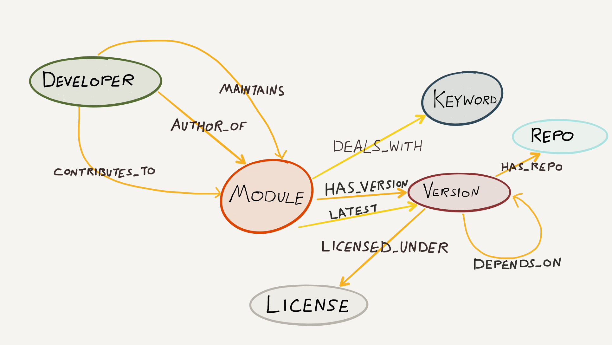
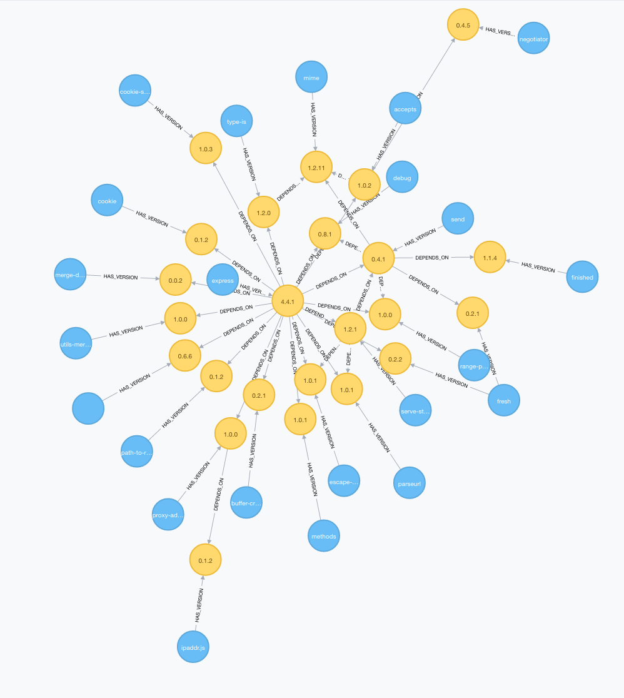

## npm-graph

Load the npm registry into Neo4j for graph based module dependency analysis

### Data model

### Querying npm-graph

#### Find all nested dependencies for Express npm module

~~~ cypher
MATCH (p:Package {name: "express"})
MATCH (p)-[:HAS_VERSION]->(v:Version)
WHERE v.version = "4.4.1"
MATCH path=(v)-[:DEPENDS_ON*]->(:Version)<-[:HAS_VERSION]-(ndep:Package)
RETURN path, p
~~~

